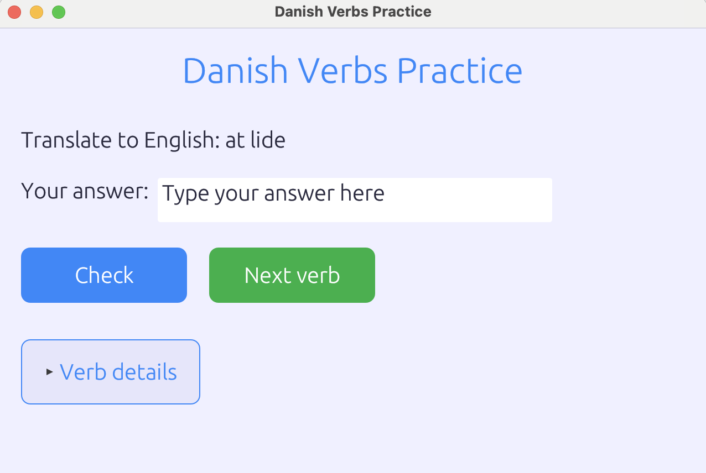

# Dansk Uddannelse

Procrastination while doing Danish homework.



## Features

- Practice translating Danish verbs to English
- Practice conjugating Danish verbs in different tenses:
  - Present tense (nutid)
  - Past tense (datid)
  - Past participle (førnutid)

## Requirements

- Rust (https://www.rust-lang.org/tools/install)

## Running the App

```bash
cd verbs
cargo run
```

## How to Use

1. The app will present you with a verb and ask you to either translate it or conjugate it
2. Type your answer in the text field
3. Press "Check" or hit Enter to check your answer
4. Press "Next verb" to move to the next practice question
5. Expand "Verb details" to see all forms of the current verb 

## Adding More Verbs

You can add more verbs to the `src/verbs.json` file. Each verb should have the following format:

```json
{
  "infinitive": "at være",
  "present": "er",
  "past": "var",
  "past_participle": "været", 
  "english": "to be"
}
```